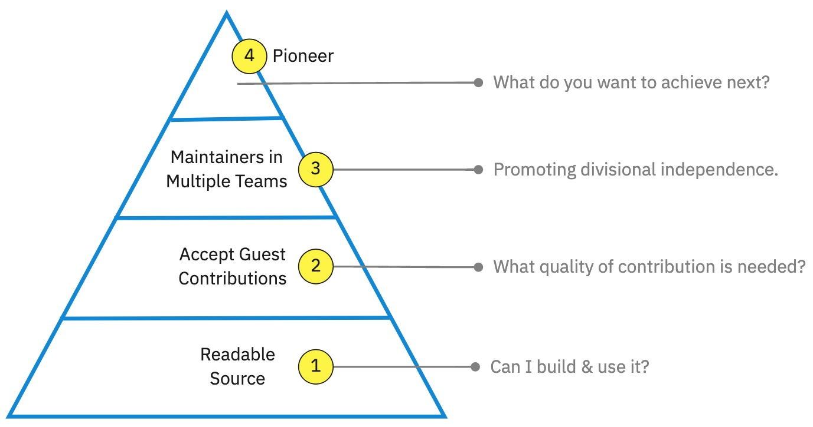

# What is Inner Source?

Inner source is defined as:

> The use of open source principles and practices for software development within the confines of an organisation.

Inner source products within the Flutter group can be used by any team, and are open to contribution from any of our ~4000 engineers, in any division or location. We use inner source as a way to leverage the scale of our business by sharing complex technical ecosystems like our betting platform whilst allowing all teams the ability to action their own specific priorities within it themselves.

Inner Source is a broad term and to clarify this within Flutter we define 4 stages of increasing maturity which our applications commonly progress through in their inner source journey.

- **Stage 0 · Closed Source** : This is the typical status of a high performing delivery team before their inner source journey begins. A single ('host') team are responsible for maintaining a service, and all changes to the service are implemented by this team. The service may be shared with other teams via API, SDK, or build artefacts for local deployment, but only the owning team have access to service source code and CI pipeline.
- **[Stage 1 · Readable Source](/how/readable-source/)** : The first step towards the transparency required for inner source to work. The host team are responsible for developing the service and run their own deployment, with all changes to the service implemented by the host. However, other teams may also be deploying and using the service or including parts of it in their own services -- possible because the host team granted read access to user stories, source code, test suites, CI pipeline and build artifacts to all Flutter engineers.
- **[Stage 2 · Accept Guest Contributions](/how/guest-contributions/)** : The host team retain full accountability for the service development and encourage and review 'guest' contributions from other teams who need to change it either for their own deployments or projects. If the host team deem the guest contribution to be of sufficient quality it will be accepted and the host team will take forward responsibility for it, otherwise it may be rejected or re-worked.
- **Stage 3 · Maintainers in Multiple Teams** : Multiple teams need to make regular changes to the service via a consensus mechanism. For consensus to be fast at least one person in every regularly contributing team must be an expert "maintainer": taking the time to build relationships and trust with the experts in the other teams.
- **Stage 4 · Pioneers** : At this stage no well established ways of working patterns exist and various groups are experimenting with different approaches.

This is visually represented as the Inner source pyramid because each stage builds upon the previous one and is not possible without it. Higher stages in the pyramid are more complex, and that complexity is only justified if the circumstances require it (e.g. a high volume of contribution). So each inner source application will have an optimum position in the pyramid, the rest of the docs in this section are here to help you reach that optimum.
